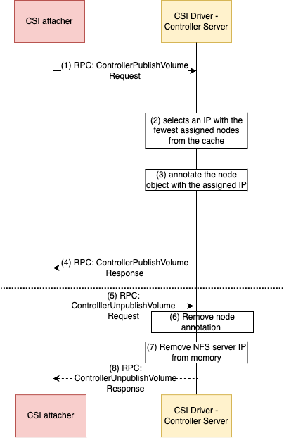

# GKE NFS LoadBalancer CSI driver for Kubernetes

## Overview

This is a fork of the [OSS NFS CSI Driver](https://github.com/kubernetes-csi/csi-driver-nfs) which implements a dynamic load balancing of server IPs across k8s pods.
This CSI only supports CSI ControllerPublish, ControllerUnpublish, NodePublishVolume and NodeUnpublishVolume capabilities

## Design

The load-balancing NFS CSI driver is designed for NFS cluster technologies where there are multiple NFS server endpoints for a single volume. The CSI driver dynamically distributes mount points across multiple NFS server IPs at mount time. The driver maintains a count of nodes assigned to each server IP within the NFS cluster and allocates new mounts to the least utilized (by number of client connections) server, ensuring even client distribution and preventing server overload.

The load balancing NFS CSI driver consists of two components:

- **CSI Controller Driver**: This is a single replica deployment, responsible for calculating the existing connections for each NFS server in the Kubernetes cluster and dynamically assigning an NFS server IP to a mount once the Pod is scheduled to a node. It also unassigns an NFS server IP once all the Pods have been removed on the same node and the volume has been unmounted.
- **CSI Node Driver**: This is a DaemonSet running on each host node, responsible for mounting an NFS server to the client node.

### CSI Driver - Controller Server

The CSI driver controller maintains an in-memory map of NFS server IP addresses and the number of nodes assigned to each IP. Upon startup, the controller retrieves a list of NFS server IP addresses from the `--ip-addresses` flag, lists all existing nodes, and updates the in-memory map based on the `nfs.lb.csi.storage.gke.io/assigned-ip` node annotation.

The following diagram shows the high level workflow of mounting/unmounting a NFS volume for a pod with the Load Balancing NFS CSI driver - Controller Server. 



#### ControllerPublishVolume

This gRPC function is invoked when a pod is scheduled to a node. The CSI driver controller first checks if the node has a valid NFS server IP assigned. If not, it selects an IP with the fewest assigned nodes from the cache and assigns that IP to the node by adding an annotation to the node object. If the node object update fails, ControllerPublishVolume retries in the next reconcile loop. Upon successful IP assignment and node update, the controller passes the assigned IP through `PublishContext` to the CSI driver node.

#### ControllerUnpublishVolume

This gRPC function is invoked when all pods have been removed from the node and the volume unmounted. The CSI driver removes the assigned IP address for the attached node from the in-memory map. Upon successful removal, the node annotation is removed and a successful RPC response is returned.

### CSI Driver - Node Server

The CSI driver node retrieves the IP address from `PublishContext` and uses it to mount the NFS share. The server name and `volumeHandle` are ignored by the CSI driver node. Only `NodePublishVolume` and `NodeUnpublishVolume` were implemented for the CSI driver node server.

The following diagram shows the high level workflow of mounting/unmounting a NFS volume for a pod with the Load Balancing NFS CSI driver - Node Server. 


### Install driver on a Kubernetes cluster

- Install via [helm charts](./docs/helm-install-csi-driver.md)

## Examples

Please refer to a full e2e [example](./docs/nfs-workload-example.md) to deploy a pool of NFS servers and NFS Clients using the NFS LB CSI Driver

### Persistent Volume Spec

For mounting an NFS server cluster as a volume, the PV object will exhibit the following specifications:

```yaml
apiVersion: v1
kind: PersistentVolume
metadata:
  name: nfs-pv
spec:
  mountOptions:
    - vers=3
    - nconnect=16
    - rsize=1048576
    - wsize=1048576
    - nolock
    - read_ahead_kb=15360
  storageClassName: ""
  capacity:
    storage: 12Ti
  accessModes:
    - ReadWriteMany
  persistentVolumeReclaimPolicy: Retain
  volumeMode: Filesystem
  csi:
    driver: nfs.lb.csi.storage.gke.io
    volumeHandle: nfs-server.default.svc.cluster.local/gpfs/fs1
    volumeAttributes:
      share: /gpfs/fs1
```

#### Notes

- `mountOptions`: Users can specify [`mount.nfs(8)`](https://linux.die.net/man/8/mount.nfs) options, along with `read_ahead_kb`, to fine-tune the kernel page cache for NFS mounts.
- `capacity`: The capacity of the NFS server cluster instance.
- `csi.volumeHandle`: A unique identifier for the NFS server cluster.
- `csi.volumeAttributes.share`: The file share to be mounted. The driver currently supports mounting only a single file share within the NFS server cluster.

## Limitations of the Design

- The driver lacks the ability to identify which NFS server IP address has become unavailable.
- The driver does not support dynamic addition or removal of NFS server IP addresses without requiring reinstallation.
- If a significant number of nodes in the node pool are removed simultaneously, IP allocation may become imbalanced.
- The current design assumes there is only a single NFS server cluster that all clients in the cluster will connect to. Support for different clusters can be a future enhancement.
- Can only evenly distribute mounts within a single Kubernetes cluster.
- The driver only supports mounting a single file share within the NFS server cluster, as specified in the volume attributes.

## Troubleshooting

- Refer to [troubleshooting](./docs/troubleshooting/guide.md)

## Code of conduct

Participation in the Kubernetes community is governed by the [Kubernetes Code of Conduct](code-of-conduct.md).
